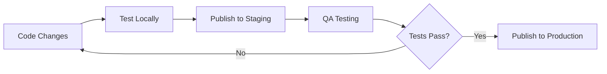

# OTA (Over-The-Air) Updates Deployment Guide

## Overview

This guide explains how to use the OTA update system configured for the Trade Coin Skills app. The system uses Expo EAS Updates with two channels: **staging** and **production**.

## Channel Strategy

### Staging Channel
- **Purpose**: Internal testing, QA, and pre-production validation
- **Audience**: Development team, beta testers
- **Update Frequency**: As needed for testing new features
- **Connected Build Profile**: `preview`

### Production Channel
- **Purpose**: Live app updates for end users
- **Audience**: App Store/Play Store users
- **Update Frequency**: Stable releases only
- **Connected Build Profile**: `production`

## Available Commands

### Publishing Updates

```bash
# Publish to staging channel (for testing)
yarn publish:staging

# Publish to production channel (for live users)
yarn publish:production
```

### Building Apps

```bash
# Build staging version (connected to staging channel)
yarn build:staging

# Build production version (connected to production channel)
yarn build:production
```

### Legacy Update Commands (if needed)

```bash
# Update with branch-based approach
yarn update:staging    # Updates main branch
yarn update:production # Updates production branch
```

## Deployment Workflow

### 1. Development & Testing Flow



### 2. Step-by-Step Process

#### For Staging Deployment:
1. **Make your changes** and test locally
2. **Commit your changes** with a descriptive commit message
3. **Publish to staging**:
   ```bash
   yarn publish:staging
   ```
4. **Test on staging** using preview builds or existing staging apps
5. **Validate functionality** and user experience

#### For Production Deployment:
1. **Ensure staging tests pass** completely
2. **Create a production-ready commit** with final changes
3. **Publish to production**:
   ```bash
   yarn publish:production
   ```
4. **Monitor app performance** and user feedback
5. **Be ready to rollback** if issues arise

## Update Configuration

### Automatic Update Checking
- **Frequency**: Every 5 minutes when app is active
- **Trigger**: App launch (ON_LOAD)
- **User Experience**: Alert shown when update is available
- **Fallback Timeout**: 30 seconds

### Update Behavior
- **Download**: Manual trigger via alert
- **Installation**: Requires app restart
- **Channels**: Apps automatically receive updates from their assigned channel

## Environment Configuration

### Staging Environment
```json
{
  "ENVIRONMENT": "staging",
  "channel": "staging"
}
```

### Production Environment
```json
{
  "ENVIRONMENT": "production", 
  "channel": "production"
}
```

## Build Profiles Mapping

| Build Profile | Channel | Environment | Use Case |
|---------------|---------|-------------|----------|
| `development` | none | development | Local development |
| `preview` | staging | staging | Internal testing |
| `production` | production | production | App Store release |

## Best Practices

### 1. Testing Strategy
- **Always test on staging first** before production deployment
- **Use different test accounts** for staging vs production
- **Validate critical user flows** after each update

### 2. Update Timing
- **Production updates**: Deploy during low-traffic hours
- **Staging updates**: Can be deployed anytime
- **Emergency fixes**: Use production channel for critical bug fixes

### 3. Monitoring
- **Watch app logs** after deployment for errors
- **Monitor user feedback** for update-related issues
- **Track update adoption rates** via EAS dashboard

### 4. Rollback Strategy
- **Keep previous working version** ready for quick deployment
- **Have rollback plan** for critical issues
- **Test rollback process** periodically

## Troubleshooting

### Common Issues

#### Updates Not Showing
1. Check if update was published successfully:
   ```bash
   eas update:list --branch [channel-name]
   ```
2. Verify app is connected to correct channel
3. Check network connectivity on device

#### Build-Update Mismatch
1. Ensure build profile has correct channel configured
2. Verify environment variables match between build and update
3. Check EAS project configuration

#### Update Download Fails
1. Check update size (large updates may fail on poor connections)
2. Verify no breaking changes in native dependencies
3. Test with different network conditions

### Debug Commands

```bash
# List all updates for a channel
eas update:list --branch staging
eas update:list --branch production

# View update details
eas update:view [update-id]

# Check build information
eas build:list --platform all
```

## Security Considerations

### Channel Access
- **Staging**: Should be restricted to development team
- **Production**: Requires careful review and approval process
- **API Keys**: Use environment-specific keys for each channel

### Update Verification
- **Code review** required before production updates
- **Automated testing** in CI/CD pipeline
- **Manual QA** on staging channel

## EAS Dashboard

Access your project updates at:
- **Project URL**: `https://expo.dev/accounts/dustindoan/projects/trading-simulation-app`
- **Project ID**: `ff964db9-1fa1-4563-98c5-478459b0c294`

## Emergency Procedures

### Critical Bug Fix
1. **Identify the issue** and create fix
2. **Test fix locally** with minimal changes
3. **Skip staging** if truly critical (document reason)
4. **Deploy to production** immediately:
   ```bash
   yarn publish:production
   ```
5. **Monitor closely** for 30 minutes after deployment
6. **Prepare rollback** if issues persist

### Rollback Process
1. **Identify last working update ID** from EAS dashboard
2. **Republish previous working version**:
   ```bash
   eas update --channel production --message "Rollback to stable version"
   ```
3. **Notify team** of rollback action
4. **Investigate root cause** of the issue

## Support and Resources

- **EAS Updates Documentation**: https://docs.expo.dev/eas-update/introduction/
- **Project Dashboard**: https://expo.dev/accounts/dustindoan/projects/trading-simulation-app
- **Team Communication**: Use designated channels for update notifications

---

*Last updated: January 2025*
*For questions or issues, contact the development team.*
